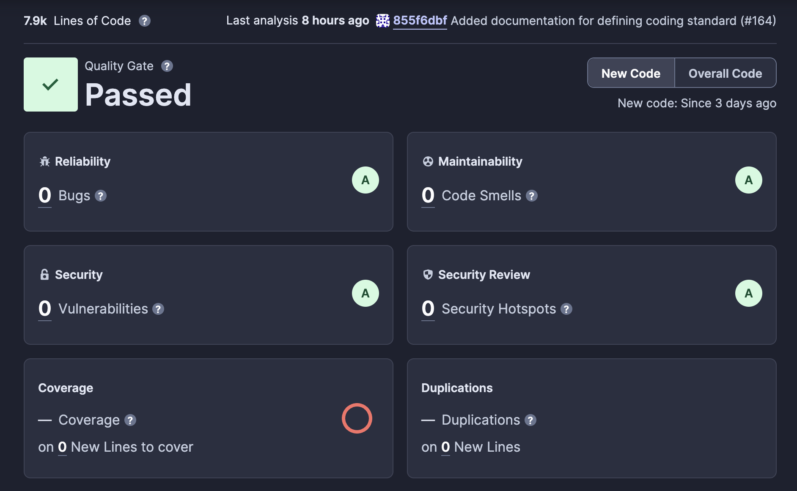

# Spendr Release Summary

## Team Members

| Name                  | Email                                              | GitHub username | Role                                         |
| --------------------- | -------------------------------------------------- | --------------- | -------------------------------------------- |
| Daniel La Rocque      | [larocq17@myumanitoba.ca](larocq17@myumanitoba.ca) | dlarocque       | Full Stack Developer                         |
| Victoria Kogan        | [koganv@myumanitoba.ca](koganv@myumanitoba.ca)     | VictoriaKGN     | Frontend Developer                           |
| Mark Lysack           | [lysackm@myumanitoba.ca](lysackm@myumanitoba.ca)   | lysackm         | Backend Developer and CI/CD                  |
| Barbara Guzman Romero | [guzmanrb@myumanitoba.ca](guzmanrb@myumanitoba.ca) | BarbzCodez      | Frontend Developer                           |
| Ethan Ducharme        | [duchar36@myumanitoba.ca](duchar36@myumanitoba.ca) | DucharmeEthan   | Backend Developer and Database Administrator |

## Project Summary

In today's digital age, the ability to efficiently manage finances has become essential for individuals and groups alike. With this understanding, we present Spendr, an innovative solution engineered to offer users a holistic view of their finances and empower them with the tools necessary to make informed decisions.

Embracing the Spendr vision, we've not only progressed but elevated our journey! Checkout how we implement all the user stories, enhancing them with a cutting-edge auto form filler to add expenses directly from images.

### GitHub Repository

[Spendr GitHub Repository](https://github.com/BarbzCodez/Spendr)

### DockerHub repository

DockerHub is a way to automatically deploy versions of both the server image and the client image. These images can be pulled and used to run the most recent version of the app. DockerHub also has previous versions of the application which can be used. These images are pushed automatically by the CD pipeline which is ran via github actions.

The Docker image includes everything to run the application. Once the docker image is run, no additional actions are required to launch the application.

#### DockerHub Links

- [Spendr client](https://hub.docker.com/r/lysackm/spendr-client)
- [Spendr server](https://hub.docker.com/r/lysackm/spendr-server)

#### DockerHub Instructions

First pull the images using the commands `docker pull lysackm/spendr-client` and `docker pull lysackm/spendr-client`. Then you need to have a configured postgres database running for the app to work. The following Dockerfile can be used to run the client and server images:

```bash
<dockerfile>
   db:
    image: postgres:latest
    volumes:
      - ./db/init.sql:/docker-entrypoint-initdb.d/init.sql
    environment:
      POSTGRES_DB: spendr_database
      POSTGRES_USER: admin
      POSTGRES_PASSWORD: admin
    ports:
      - "5432:5432"

  pgadmin:
    image: dpage/pgadmin4
    environment:
      PGADMIN_DEFAULT_EMAIL: 'admin@admin.com'
      PGADMIN_DEFAULT_PASSWORD: 'root'
    ports:
      - '5050:80'
```

After having the database container started, spin up the client and server containers to start the app running locally.

### User Stories

The User Stories are documented in our [Project Proposal User Stories](project-proposal.md#user-stories).

The progress of the Spendr development can be found on the Git Milestone page.

- [Sprint 1](https://github.com/BarbzCodez/Spendr/milestone/1?closed=1)
- [Sprint 2](https://github.com/BarbzCodez/Spendr/milestone/2?closed=1)
- [Sprint 3](https://github.com/BarbzCodez/Spendr/milestone/3?closed=1)
- [Sprint 4](https://github.com/BarbzCodez/Spendr/milestone/4?closed=1)

Note: The links go to to the closed user stories, you can click in each user user story to see when they where finished.

## User Manual

### User Management


#### Create a User

1. Go to where the Spendr is being hosted.
2. Click **Get Started**.
3. Enter all the fields (Username, Password, Security Question and Security Answer) Make sure they are all correct.
4. Click **Sign Up**, you will see a green pop up saying that you have been successfully singed in.
5. Wait until you get redirected to the main page.

#### Log In

1. Go to where the Spendr is being hosted.
2. Click **Log In**
3. Enter your Username and Password.
4. Click **Log In**.
5. You should be redirected to the main home page.

#### Log Out

1. When you are logged in in Spender.
2. Click the **User Icon** at the top right.
3. Click **Log Out**.
4. You should be redirected to the home page.

#### Edit Credentials

1. Make sure you are a logged in user.
2. Click the **User Icon**.
3. Click **Settings**.
4. Click the edit icon next to **username** or **password**.
5. Type in your new values.
6. Click the **Save** icon.
7. A successfully updated popup should appears.

#### User Deletion

1. Make sure you are a logged in user.
2. Click the **User Icon**.
3. Click **Settings**.
4. Click **Delete Account**.
5. You should have a popup saying that your account was successfully deleted and redirected to the main menu.

### Expense Management


#### View your Expenses

1. Make sure you are a logged in user.
2. Click **Expenses** on the top bar.
3. You should see all your expenses on the table.

#### Create an Expense

1. Make sure you are a logged in user.
2. Click **Expenses** on the top bar.
3. Click **Add Expense**.
4. Fill in all the required fields (title, amount, category, and date).
5. Click **Save**.
6. Your new expense should be shown in the table.

#### Edit an Expense

1. Make sure you are a logged in user and have created an expenses.
2. Click **Expenses** on the top bar.
3. Click on the **Edit Icon** in the expense you want to edit.
4. Update the field you want to change.
5. Click **Save**.
6. Your updated expense should be shown in the table.

#### Delete an Expense

1. Make sure you are a logged in user and have created an expenses.
2. Click **Expenses** on the top bar.
3. Click on the **Delete Icon** in the expense you want to delete.
4. Your updated expense should be deleted from the table.

### Budget Management


#### View your Budgets

1. Make sure you are a logged in user.
2. Click **Budgets** on the top bar.
3. You should see all your budgets listed.

#### Create a Budget

1. Make sure you are a logged in user.
2. Click **Budgets** on the top bar.
3. Click **Add Budget**.
4. Fill in all the required fields (amount, category and duration).
5. Click **Save**.
6. Your new budget should be shown in the list with how much you have used of it.

#### Edit a Budget

1. Make sure you are a logged in user and have created a budget.
2. Click **Budgets** on the top bar.
3. Click on the **Edit Icon** in the budget you want to edit.
4. Update the field you want to change.
5. Click **Save**.
6. Your updated budget should be shown in the list.

#### Delete a Budget

1. Make sure you are a logged in user and have created a budget.
2. Click **Budgets** on the top bar.
3. Click on the **Delete Icon** in the expense you want to delete.
4. Your updated expense should be deleted from the table.

### Expense Analytics


#### Current Month Analysis

1. Make sure you are a logged in user with expenses in current and past months.
2. Click **Analytics** on the top bar.
3. On the top portion you should see two graphs, one fo the current month expenses and one of the current month by category. Hover over them to see more details about your monthly expenses.

#### Compare Months

1. Make sure you are a logged in user with expenses in current and past months.
2. Click **Analytics** on the top bar.
3. On the Bottom portion of the page there is a dropdown on months, select two completed months to see the daily expense comparison.

### Group Expense Splitting


#### View your Group Expenses

1. Make sure you are a logged in user with expenses in current and past months.
2. Click **Group Expenses** on the top bar.
3. You should see a table with your group expenses.

#### Create a Group Expense

1. Make sure you are a logged in user.
2. Click **Group Expenses** on the top bar.
3. Click **Add Group Expense**.
4. Fill in all the required fields (title, amount, category, and date).
5. Click **Add User** to add the total amount of users in the split and use **Delete User** if you want less users.
6. If you want to enter manual percentages, use the switch of **Distribute Evenly** to enter manual proportions
7. Add usernames in each of the inputs of registered Spendr users.
8. Click **Save**.
9. Your new Group Split should be shown in the table.

#### Mark a Group Expense as Paid

1. Make sure you are a logged in user and have created a group expense or have been added to one.
2. Click **Group Expenses** on the top bar.
3. In a row where you have not paid your part, click on the checkbox with your name besides it.
4. Read and confirm the disclaimer.
5. That row should be have a checkmark on your name, and a new expense is added to your expenses on th **Expenses** page.

## Architecture Design

This is the Spendr [Architecture Design](https://github.com/BarbzCodez/Spendr/blob/main/documentation/architecture/client-server-architecture.jpeg).


### Sequence Diagrams

#### [User Management](https://github.com/BarbzCodez/Spendr/blob/main/documentation/sequence-diagrams/user-management.jpeg)


#### [Expense Management](https://github.com/BarbzCodez/Spendr/blob/main/documentation/sequence-diagrams/expense-management.jpeg)


#### [Budget Management](https://github.com/BarbzCodez/Spendr/blob/main/documentation/sequence-diagrams/budget-management.jpeg)


#### [Expense Analytics](https://github.com/BarbzCodez/Spendr/blob/main/documentation/sequence-diagrams/expense-analytics.jpeg)


#### [Group Expense Splitting](https://github.com/BarbzCodez/Spendr/blob/main/documentation/sequence-diagrams/group-expense-splitting.jpeg)


## Infrastructure

### Libraries


- [Material UI](https://mui.com/material-ui/)
  - We used Material UI to make the components in the front end.
  - We chose it because is an industry standard, it has pretty icons and some of our developers have worked with it.

- [Prisma](https://www.prisma.io)
  - Prisma an object-relational mapping (ORM) library for TypeScript and JavaScript.
  - We wanted to use it so that its easier to add queries.

- [Node.js](https://nodejs.org/en)
  - Node.js is an industry standard, open-source, cross-platform JavaScript / Typescript runtime environment.
  - We used it because most of our project was coded in Typescript.

- [Express-validator](https://express-validator.github.io/docs/)
  - A set of middlewares for Express.js that wraps validator.js and sanitizes functions.
  - We used it for user input validation.

- [Bcrypt](https://www.npmjs.com/package/bcrypt)
  - Bcrypt is used for hashing passwords securely.
  - We used it to secure the passwords in user management.

- [Body-parser](https://expressjs.com/en/resources/middleware/body-parser.html)
  - Body-parser is middleware for parsing the body of incoming HTTP requests.
  - We used it since we are using Express to parse the API requests.

- [Dotenv](https://www.npmjs.com/package/dotenv)
  - Dotenv is used for loading environment variables from a .env file.
  - We chose it since is good at keeping API keys and database connection secure.

- [Jsonwebtoken](https://www.npmjs.com/package/jsonwebtoken)
  - An implementation of JSON Web Tokens.
  - We used it for user authentication.

- [Morgan](https://expressjs.com/en/resources/middleware/morgan.html)
  - Morgan is an HTTP request logger middleware for Node.js.
  - We used it to make it easier to develop and have better logs.

- [Jest](https://jestjs.io)
  - Framework to test in Javascript / Typescript.
  - We used it to test the API.

- [Supertest](https://www.npmjs.com/package/supertest)
  - Library for testing HTTP assertions.
  - We used it to test the API.

- [ESLint](https://eslint.org)
  - Javascript / Typescript linter.
  - Used ESLint to find inconsistences in our code with the prettier configuration

- [Typescript](https://www.typescriptlang.org)
  - TypeScript is a superset of JavaScript that adds static types to the language.
  - We chose it since we wanted that extra layer of static types and type-safety in our code

### Framework

- [React](https://react.dev)
  - Industry standard front end framework.
  - We choose React because is an industry standard and some of our developers have already had experience with it.
- [Express.js](https://expressjs.com)
  - Express is a minimalist web framework for Node.js.
  - We used this one since our front end is in typescript so we wanted all the project to be in the same language.

### Database

- [PostgreSQL](https://www.postgresql.org)
  - We chose PostgreSQL because some of our developers have already worked on it

### Tools

- [Docker](https://www.docker.com)
  - We chose Docker for containerization since it was the easiest way to have a consistent way of running the project.
- [GitHub Actions](https://github.com/features/actions)
  - We chose GitHub Actions since it allowed us to run jobs in the cloud for free and required minimal setup.

## Naming Conventions

We followed the [Google TypeScript naming conventions](https://google.github.io/styleguide/tsguide.html#identifiers) for identifier naming conventions.

## Code

These are the five most important files in our repo:

| Path                                    | Purpose                                            |
| --------------------------------------- | -------------------------------------------------- |
| `client/src/App.tsx`                    | The entry point for the client.                    |
| `server/src/middleware/authenticate.ts` | Middleware for authenticating HTTP requests.       |
| `server/src/routes/users.ts`            | Defines the API routes for the `/users` endpoints. |
| `server/src/app.ts`                     | The entry point for the server.                    |
| `docker-compose.yml`                    | Defines the set up for the Docker environment      |

## Continuous Integration and Deployment (CI/CD)

Both our CI/CD pipelines were created using Github Actions. The CI pipeline was triggered when a PR was created, or updated. This builds both the server and client separately. Verifying that both are able to build from that branch. As well as running the test suits and using a linter to check for formatting errors. Now the code smells are reported using SonarCloud when the CI pipeline triggers. The results are then able to be seen in the github actions tab or the PR itself.

The CD pipeline runs when a commit is added to the main branch, most likely from a PR being closed. It builds the client and server, then creates a docker image which is then pushed to DockerHub.

[Continuous Integration](https://github.com/BarbzCodez/Spendr/blob/main/.github/workflows/ci.yml)

[Continuous Deployment](https://github.com/BarbzCodez/Spendr/blob/main/.github/workflows/cd.yml)

### Snapshots

[CD](https://github.com/BarbzCodez/Spendr/actions/runs/6985882437/job/19010698130)


[CI](https://github.com/BarbzCodez/Spendr/actions/runs/7010842181)


[CI/CD Workflow](https://github.com/BarbzCodez/Spendr/actions/workflows/cd.yml)

## Testing

[Testing Plan](https://github.com/BarbzCodez/Spendr/blob/main/documentation/test-plan.md)

### Unit Tests

| Test File                                                                                                                       | Test Purpose                                                                                                  |
| ------------------------------------------------------------------------------------------------------------------------------- | ------------------------------------------------------------------------------------------------------------- |
| [authenticate.test.ts](https://github.com/BarbzCodez/Spendr/blob/main/server/src/test/unit/middleware/authenticate.test.ts#L23) | Validates that requests with no tokens return a 401.                                                          |
| [authenticate.test.ts](https://github.com/BarbzCodez/Spendr/blob/main/server/src/test/unit/middleware/authenticate.test.ts#L30) | Validates that requests with an invalid token return a 401.                                                   |
| [budgets.test.ts](https://github.com/BarbzCodez/Spendr/blob/main/server/src/test/unit/routes/budgets.test.ts#L19)               | Validates that a request with a valid body to create a budget returns a 201.                                  |
| [budgets.test.ts](https://github.com/BarbzCodez/Spendr/blob/main/server/src/test/unit/routes/budgets.test.ts#L40)               | Validates that a request with a valid body to create a budget without a category returns a 201.               |
| [expenses.test.ts](https://github.com/BarbzCodez/Spendr/blob/main/server/src/test/unit/routes/expenses.test.ts#L19)             | Validates that a request with a valid body to create an expense returns a 201.                                |
| [expenses.test.ts](https://github.com/BarbzCodez/Spendr/blob/main/server/src/test/unit/routes/expenses.test.ts#L43)             | Validates that a request with an invalid title to create an expense returns a 400.                            |
| [groupExpenses.test.ts](https://github.com/BarbzCodez/Spendr/blob/main/server/src/test/unit/routes/groupExpenses.test.ts#L36)   | Validates that a request with a valid body to create a group expense returns a 201.                           |
| [groupExpenses.test.ts](https://github.com/BarbzCodez/Spendr/blob/main/server/src/test/unit/routes/groupExpenses.test.ts#L84)   | Validates that a request with an invalid title to create a group expense returns a 400.                       |
| [users.test.ts](https://github.com/BarbzCodez/Spendr/blob/main/server/src/test/unit/routes/users.test.ts#L964)                  | Validates that a request to fetch the total expenses for categories returns a 200 if the expenses are found.  |
| [users.test.ts](https://github.com/BarbzCodez/Spendr/blob/main/server/src/test/unit/routes/users.test.ts#1031)                  | Validates that a request to fetch the total expenses for categories returns a 400 if the user does not exist. |

### Integration Tests

| Test File                                                                                                                                            | Test Purpose                                                                                                                  |
| ---------------------------------------------------------------------------------------------------------------------------------------------------- | ----------------------------------------------------------------------------------------------------------------------------- |
| [login.test.ts](https://github.com/BarbzCodez/Spendr/blob/main/server/src/test/integration/users/login.test.ts#L5)                                   | Validates that a JWT is returned upon successful login, and it can be used to make authenticated requests.                    |
| [createGroupExpense.test.ts](https://github.com/BarbzCodez/Spendr/blob/main/server/src/test/integration/groupExpenses/createGroupExpense.test.ts#L6) | Validates that a group expense is created in the database upon successful request.                                            |
| [deleteExpense.test.ts](https://github.com/BarbzCodez/Spendr/blob/main/server/src/test/integration/expenses/deleteExpense.test.ts)                   | Validates that an expense is deleted in the database upon request to delete.                                                  |
| [createBudget.test.ts](https://github.com/BarbzCodez/Spendr/blob/main/server/src/test/integration/budgets/createBudget.test.ts)                      | Validates that a budget is created upon successful request.                                                                   |
| [deleteUser.test.ts](https://github.com/BarbzCodez/Spendr/blob/main/server/src/test/integration/users/deleteUser.test.ts)                            | Validates that a users account is deleted in the database, and can no longer successfully login after deleting their account. |

### Acceptance Tests

All acceptance tests are outlined in our documentation, and test steps are included in the test files, along with the expected outcome.

| Test File                                                                                                                                                                                 | Test Purpose                            |
| ----------------------------------------------------------------------------------------------------------------------------------------------------------------------------------------- | --------------------------------------- |
| [budget-management-tests.md](https://github.com/BarbzCodez/Spendr/blob/main/documentation/acceptance-tests/budget-management-tests.md)                                                    | Create, view, and modify Budget.        |
| [expense-analytics-tests.md](https://github.com/BarbzCodez/Spendr/blob/main/documentation/acceptance-tests/expense-analytics-tests.md#view-current-month-analytics)                       | View current month analytics.           |
| [expense-management-tests.md](https://github.com/BarbzCodez/Spendr/blob/main/documentation/acceptance-tests/expense-management-tests.md#create-edit-and-delete-expense)                   | Create, edit, and delete expense.       |
| [group-expense-splitting-tests.md](https://github.com/BarbzCodez/Spendr/blob/main/documentation/acceptance-tests/group-expense-splitting-tests.md#create-group-expense-view-distribution) | Create group expense view distribution. |
| [user-management-tests.md](https://github.com/BarbzCodez/Spendr/blob/main/documentation/acceptance-tests/user-managagement-tests.md#register-login-and-logout)                            | Register, login, and logout.            |

### Regression Testing

Regression testing is done by running all unit tests after each commit to main in GitHub Actions.

### Load Testing

The load testing was done using JMeter, then run against a locally running version of the app. The test cases was a simulation of what a standard user may do when using the app. This includes creating an account, logging in, creating an expense, fetching expense data, creating a budget, and fetching budget, fetching analytics data, creating and fetching group expenses.

#### Load Testing: JMeter Summary Report

| Label                 | # Samples | Average | Min | Max | Std. Dev. | Error % | Throughput | Received KB/sec | Sent KB/sec | Avg. Bytes |
| --------------------- | --------- | ------- | --- | --- | --------- | ------- | ---------- | --------------- | ----------- | ---------- |
| create user1          | 20        | 215     | 0   | 275 | 24.65     | 0.00%   | 1.97161    | 0.69            | 0.55        | 358.9      |
| create user2          | 20        | 222     | 0   | 435 | 65.54     | 0.00%   | 1.96967    | 0.69            | 0.55        | 358.9      |
| login                 | 20        | 70      | 0   | 100 | 12.17     | 0.00%   | 1.99283    | 0.94            | 0.45        | 481.7      |
| create expense        | 20        | 69      | 0   | 135 | 19.12     | 0.00%   | 2          | 0.9             | 0.55        | 459        |
| fetch expenses        | 20        | 4       | 0   | 16  | 3.22      | 0.00%   | 2.01227    | 0.58            | 0.33        | 293        |
| add budget            | 20        | 115     | 0   | 190 | 32.6      | 0.00%   | 2.0008     | 0.81            | 0.45        | 413        |
| fetch budgets         | 20        | 7       | 0   | 13  | 3.35      | 0.00%   | 2.01837    | 0.58            | 0.32        | 293        |
| fetch analytics       | 240       | 5       | 0   | 17  | 2.07      | 0.00%   | 24.09155   | 6.89            | 5.78        | 293        |
| create group expenses | 20        | 278     | 0   | 331 | 36.67     | 0.00%   | 1.97316    | 0.85            | 0.64        | 440        |
| fetch group expenses  | 20        | 7       | 0   | 23  | 5         | 0.00%   | 2.00582    | 1.1             | 0.34        | 559.8      |
| TOTAL                 | 420       | 50      | 0   | 435 | 84.9      | 0.00%   | 38.40176   | 12.81           | 9.1         | 341.6      |


A bottleneck found during load testing was the amount of data that fetching group expenses caused. Since this is an operation that happens whenever the group expenses page is loaded, this is a frequent API call. This means that the high data transfer should be reduced. This could be solved by using caching on client side, or an optimization of the data returned from the endpoint.

### Security Analysis

We use SonarCloud as our security analysis tool. The analysis is run on each pull request, and each merge
to main in the [sonarcloud.yml](https://github.com/BarbzCodez/Spendr/blob/main/.github/workflows/sonarcloud.yml) GitHub Action.
There are no detected problems on the 7.9k LOC analyzed.

